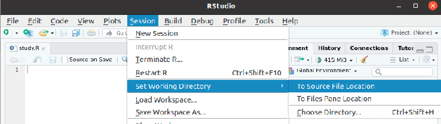

# R y Rstudio. ¿Qué es R?

R es un conjunto integrado de programas para manipulación de datos, cálculo y gráficos.
Entre otras características dispone de:

- almacenamiento y manipulación efectiva de datos,
- operadores para cálculo sobre variables indexadas (Arrays), en particular matrices,
- una amplia, coherente e integrada colección de herramientas para análisis de datos,
- posibilidades gráficas para análisis de datos, que funcionan directamente sobre pantalla
o impresora, y
- un lenguaje de programación bien desarrollado, simple y efectivo, que incluye
condicionales, ciclos, funciones recursivas y posibilidad de entradas y salidas. (Debe
destacarse que muchas de las funciones suministradas con el sistema están escritas en
el lenguaje R)

# R y Rstudio. ¿Qué es R-studio?

RStudio es un entorno de desarrollo integrado (IDE) para el lenguaje de programación R, dedicado a la computación estadística y gráficos. Incluye una consola, editor de sintaxis que apoya la ejecución de código, así como herramientas para el trazado, la depuración y la gestión del espacio de trabajo.

RStudio está disponible para Windows, Mac y Linux o para navegadores conectados a RStudio Server o RStudio Server Pro (Debian / Ubuntu, RedHat / CentOS, y SUSE Linux). RStudio tiene la misión de proporcionar el entorno informático estadístico R. Permite un análisis y desarrollo para que cualquiera pueda analizar los datos con R. 

# R y Rstudio. Descargar e instalar

Descargar los ejecutables de las páginas:

[https://cran.r-project.org/bin/windows/base/](https://cran.r-project.org/bin/windows/base/)

[https://www.rstudio.com/products/rstudio/download/
](https://www.rstudio.com/products/rstudio/download/
)

e instalar el software.

# Datos estadísticos. Organización

A lo largo de esta charla imaginaremos que hemos obtenido los resultados de un tratamiento sobre una serie individuos de estudio. Los individuos están separados en dos grupos, placebo y control.

|id|nombre           |dias hospitalización|grupo|
|-|-|-|-|
|1 |Joshua Thompson  |11|EXPERIMENTAL|
|2 |Kenneth Craycraft|15|EXPERIMENTAL|
|3 |Beth Wolfe       |11|EXPERIMENTAL|
|4 |Tom Short        |11|EXPERIMENTAL|
|5 |Richard Hughes   |26|PLACEBO     |
|6 |Reggie Smith     |19|PLACEBO     |
|7 |Pearl Willemsen  |11|EXPERIMENTAL|
|8 |Wanda Green      |21|PLACEBO     |
|9 |Kristen Brereton |22|PLACEBO     |
|10|Lana White       |7 |EXPERIMENTAL|

# Datos estadísticos. Ficheros csv

Para trabajar con datos estadísticos en ordenador, habitualmente usamos ficheros de texto. Estos ficheros tienen organizada la información en forma de tabla en la que cada columna representa una variable estadística y cada fila un sujeto de estudio.

El formato más habitual que se usa para el trabajor con estos ficheros de texto estadísticos es el *.csv* (comma separated value)

Un fichero csv contiene unos datos como los siguientes (si lo abrimos usando un editor de texto):

    id;nombre;dias_hospitalizacion;grupo
    0;Brian Stone;12;EXPERIMENTAL
    1;Joshua Thompson;11;EXPERIMENTAL
    2;Kenneth Craycraft;15;EXPERIMENTAL
    3;Beth Wolfe;11;EXPERIMENTAL
    4;Tom Short;11;EXPERIMENTAL
    5;Richard Hughes;26;PLACEBO
    6;Reggie Smith;19;PLACEBO
    7;Pearl Willemsen;11;EXPERIMENTAL
    8;Wanda Green;21;PLACEBO
    9;Kristen Brereton;22;PLACEBO
    10;Lana White;7;EXPERIMENTAL

como vemos, usa como separador de los datos la coma "," también pueden usar como separador el ";" o el tabulador. Cada línea del fichero será un sujeto de estudio.

En ocasiones nos darán los datos como ficheros de excel o hojas de cálculo de google docs o formatos similares. Estos formatos también pueden usarse para el trabajo estadístico con R, pero son menos convenientes, en este caso deberemos exportar el fichero a ".csv" y así obtendremos un formato con el que podemos trabajar.

# R Studio. Vista

----
{ width=350px}
----

# R Studio. Nuestro primer script

Para ello creamos en podemos crear una carpeta en el escritorio con el nombre `estudioR` y pegar allí el fichero de prueba csv `datos.csv` que contiene los datos de nuestro estudio.

Clicamos en *File > New File > R Script* y creamos nuestro nuevo script en la carpeta que hemos creado para este estudio `estudioR` y donde tenemos el fichero de datos.

  { width=250px}

# R Studio. Directorio de trabajo

El primer comando que vamos a introducir le dirá a R sobre que carpeta vamos a trabajar. Este es el *working directory*, el directorio donde tenemos los datos y guardaremos los scripts y resultados del trabajo.

Para ello la forma más sencilla 
*Session > Set Working Directory > To source file location*.

  { width=250px}

# R Studio. Ejecutar comandos

- introducir cada comando en una línea del script que hemos creado antes.
- ejecutar el comando poniendo el cursor del teclado sobre esa línea y clicando el boton `ejecutar`.
  
  { width=50px}

- ver los resultados en la consola debajo del script

# R Studio. Introducción de datos: Dataframe

Podemos ahora cargar el fichero `.csv`. Una vez fijado el directorio de trabajo ejecutamos el comando

    data <- read.csv(file = 'estudio.csv', sep=";")

Este comando crea una variable `data` dentro de la cual estarán los datos del fichero.

----
{  width=300px}
----

# R Studio. Primeros comandos

Ahora podemos calcular estiadísticos sencillos usando nuestros datos que están contenidos en el dataframe. Para acceder a la variable *dias_hospitalizacion* debo usar el comando `data$dias_hospitalizacion`. Los siguientes comandos

    mean(data$dias_hospitalizacion)
    median(data$dias_hospitalizacion)
    sd(data$dias_hospitalizacion)

Calculan la media la mediana y desviación típica. El comando

    summary(data$dias_hospitalizacion)

Me da un resumen básico de las medidas de la variable. 

# R Studio. Primeros comandos

Al ejecutarlos veré

----
{  width=350px}
----

# R Studio. Boxplot

Para poder comparar los dos grupos **placebo** y **experimental** puedo usar un diagrama de cajas, en el que se muestren ambos grupos. Para ello uso el comando

    boxplot(data$dias_hospitalizacion~data$grupo)

# R Studio. Boxplot: Resultado

----
{  width=350px}
----

# R Studio. Boxplot: Interpretación

Observando la esquina inferior en la que se despliega la  gráfica observo:
- La caja del grupo placebo está bastante más arriba que la del experimental
- La mediana (linea horizontal gorda dentro de las cajas) es notablemente superior en el grupo placebo que en el experimental.

Esto me hace sospechar que los días de hospitalización son mayores en el grupo placebo y por lo tanto el tratamiento podría haber funcionado. 

# R Studio. t-test

Asumiendo que ambas variables sigan la distribución normal, puedo realizar un test de la t de Student para ver si los dos grupos tienen distintas medias. Es decir, si hay diferencias significativas entre ambos grupos debidas al tratamiento.

Para ello usaré el comando

    t.test(data$dias_hospitalizacion~data$grupo, 
        alternative = "two.sided", var.equal = FALSE)

# R Studio. t-test: Resultado

----
{  width=350px}
----

# R Studio. t-test: Interpretación

- la parte 

        95 percent confidence interval:
            -12.276740  -7.109926

    Nos da un intervalo de confianza para la diferencia de medias. Puesto que este intervalo tiene sus dos límites negativos, deducimos que la diferencia entre las medias es negativa y que con un 95 de confianza la media dias de hospitalización del grupo placebo es mayor que la del experimental

- Otra manera de deducir esto es observando la parte
    
        p-value = 1.06e-07

    que nos dice que hemos obtenido un p-valor muy pequeño (menor que 0.05) y por lo tanto debemos rechazar la hipótesis nula que en este caso era que las medias de los días de hospitalización fueran la misma para ambos grupos.

# R Studio. Normalidad

Para que el t-test funcione asumimos que la variable sigue una distribución normal. Esto no siempre ocurre y conviene comprobarlo. Para ello tenemos dos maneras visuales, mediante un **histograma** y un **qq-plot**.

Para hacer un histograma usamos el comando:

    hist(data$dias_hospitalizacion)

y para un qq-plot los comandos:

    qqnorm(data$dias_hospitalizacion, pch = 1, frame = FALSE)
    qqline(data$dias_hospitalizacion, col = "steelblue", lwd = 2)

# R Studio. Normalidad: Resultado

----
{  width=350px}
----

# R Studio. Normalidad: Resultado

----
{  width=350px}
----

# R Studio. Normalidad: Interpretación

En nuestro caso observamos:
- El histograma se asemeja a la curva de la normal
- En el qq-plot los valores se acercan bastante a la recta

Estas dos observaciones nos indican que nuestra variable sigue una distribución normal

# R Studio. Wilcoxon

Podría ocurrir que nuestra variable **no siguiera la distribución normal**. En este caso debemos acudir a un test no paramétrico. Uno de los más adecuados en este caso el el test de los rangos signados de Wilcoxon.

Para hacerlo bastaría ejecutar: 

    wilcox.test(data$dias_hospitalizacion~data$grupo, exact = FALSE)

# R Studio. Wilcoxon: Resultado

----
{  width=350px}
----

# R Studio. Wilcoxon: Interpretación

para interpretarlo basta fijarse en la línea:

    p-value = 3.664e-07

y dado que el p-valor es menor que el nivel de significación extraeríamos que hay que rechazar la hipótesis nula que en este caso es las distribuciones son iguales.

# Referencias:
- Using R for Biostatistics, doi:10.1007/978-3-030-62404-0. Thomas MacFarland, Jan M. Yates.

# Materiales
Los materiales de esta charla están disponibles en:

[https://github.com/HugoJBello/materiales-charla-introduccion-r-bioestadistica](https://github.com/HugoJBello/materiales-charla-introduccion-r-bioestadistica)